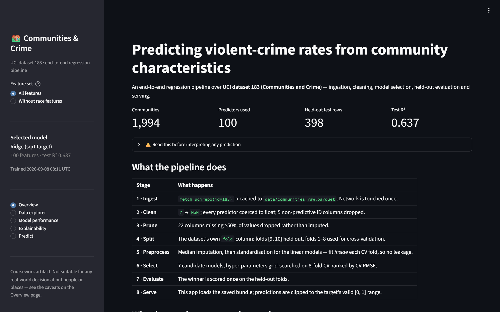
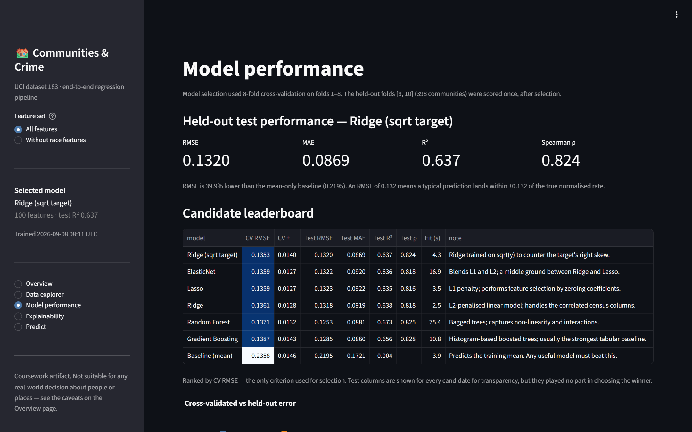
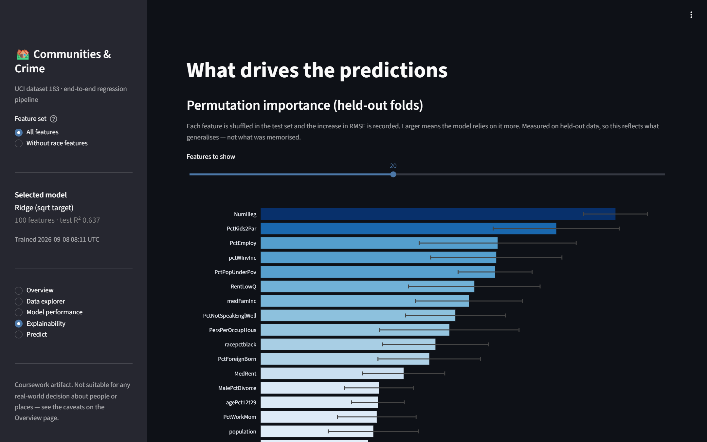
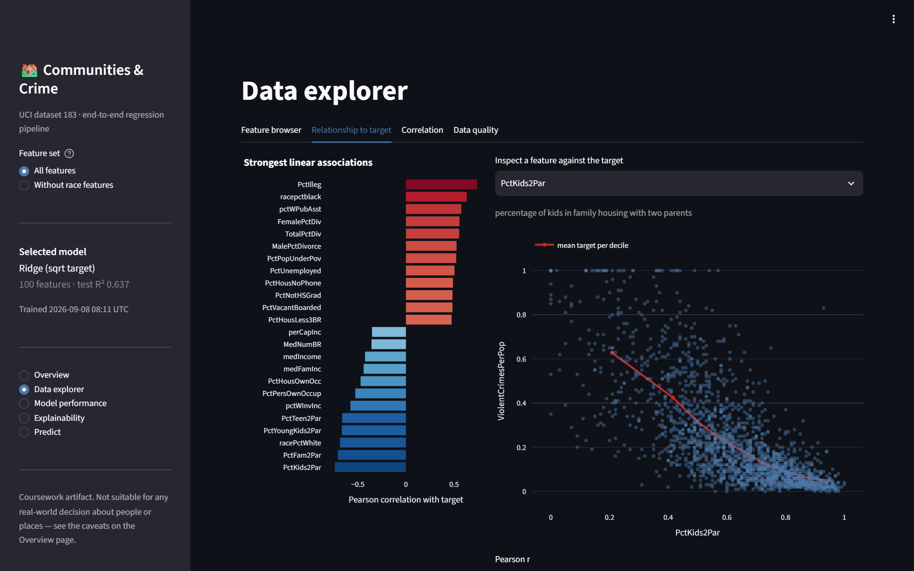
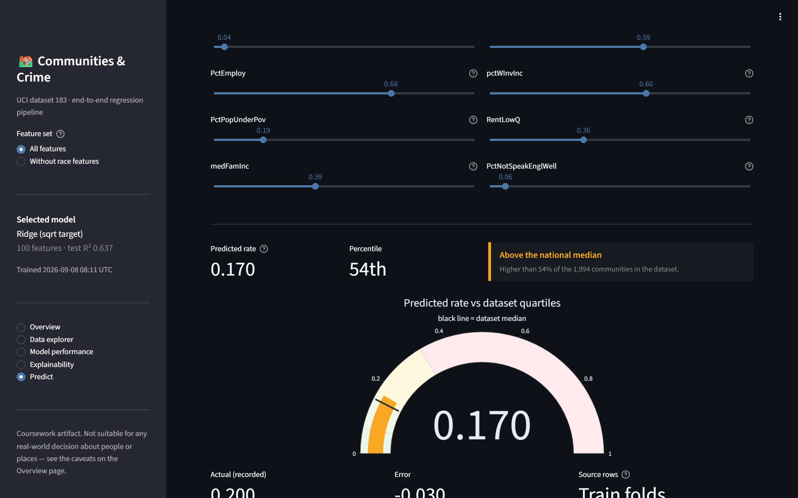

<div align="center">

# 🏘️ Communities & Crime — End-to-End ML Pipeline

**Predicting violent-crime rates of 1,994 US communities from census data, with honest evaluation, explainability, and an interactive Streamlit app.**

[](https://github.com/YOUR_USERNAME/communities-crime-ml/actions/workflows/tests.yml)


[](LICENSE)

[**Live demo**](https://YOUR_APP.streamlit.app) · [Results](#-results) · [How it works](#-how-it-works) · [Run locally](#-run-locally) · [Responsible use](#%EF%B8%8F-responsible-use)



</div>

---

## ✨ Highlights

- **Full pipeline, not a notebook:** ingestion from the UCI API → cleaning → model selection → held-out evaluation → a served model, as a tested Python package.
- **Honest evaluation:** 7 candidate models tuned with 8-fold cross-validation on the dataset's own published folds. The held-out set is scored **once**, after selection.
- **Leakage-safe preprocessing:** imputation and scaling are fit inside each CV fold through scikit-learn `Pipeline`s.
- **Explainability:** held-out permutation importance, standardised coefficients, and a per-prediction breakdown of the features that pushed it up or down.
- **Fairness experiment:** a second model trained *without* 22 race, ethnicity, and immigration features, compared side by side with the first.
- **Robust serving:** batch CSV scoring that handles column reordering, extra columns, absent predictors, and `?` missing markers.
- **40 automated checks** run in GitHub Actions on every push.

## 📊 Results

Evaluated on held-out folds 9–10 (398 communities) that were never used during model selection:

| Model | CV RMSE (8-fold) | Test RMSE | Test R² | Test MAE |
|---|---:|---:|---:|---:|
| **Ridge (√ target)** ← selected | **0.1353** | 0.1320 | 0.637 | 0.0869 |
| ElasticNet | 0.1359 | 0.1322 | 0.636 | 0.0920 |
| Lasso | 0.1359 | 0.1323 | 0.635 | 0.0922 |
| Ridge | 0.1361 | 0.1318 | 0.638 | 0.0919 |
| Random Forest | 0.1371 | 0.1253 | 0.673 | 0.0881 |
| Gradient Boosting | 0.1387 | 0.1285 | 0.656 | 0.0860 |
| Baseline (predict the mean) | 0.2358 | 0.2195 | −0.004 | 0.1721 |

- **~40% lower error than the baseline**, and R² ≈ 0.64, in line with published results on this dataset.
- **Why not Random Forest?** It has the best *test* score but a worse *CV* score. The model was chosen on CV alone, because choosing by test score would mean selecting on the held-out set. The top six models are also within one CV standard error of each other (±0.014), so their exact ranking isn't meaningful.
- **Removing the race-related features lowers R² by only 0.007** (0.637 → 0.630). The remaining census variables are correlated with the removed ones, so leaving those columns out does *not* make a model race-neutral.

<table>
<tr>
<td width="50%"><p align="center"><sub>Leaderboard with CV and held-out metrics</sub></p></td>
<td width="50%"><p align="center"><sub>Held-out permutation importance</sub></p></td>
</tr>
<tr>
<td width="50%"><p align="center"><sub>Feature-vs-target explorer</sub></p></td>
<td width="50%"><p align="center"><sub>Interactive prediction with percentile context</sub></p></td>
</tr>
</table>

## 🔧 How it works


| Stage | Decision | Why |
|---|---|---|
| **Clean** | Drop `state`, `county`, `community`, `communityname`, `fold` | The dataset authors mark these as non-predictive identifiers |
| **Prune** | Drop the 22 LEMAS police-survey columns | 84% of their values are missing; imputing them would mean inventing most of the data |
| **Split** | Folds 9–10 held out, folds 1–8 used for CV via `PredefinedSplit` | Uses the dataset's own published, non-random folds, so there's no random seed to tune |
| **Preprocess** | Median imputation + standardisation inside the `Pipeline` | Transform statistics are learned only from training folds |
| **Target** | Also try a √-transformed target (`TransformedTargetRegressor`) | The target is right-skewed (1.52) and bounded at 0 |
| **Serve** | Keep the model trained on the training folds, clip predictions to [0, 1] | The metrics shown describe the exact model being served |

### Project structure

```
├── app.py                    Streamlit frontend (5 pages)
├── src/
│   ├── config.py             paths, column groups, thresholds
│   ├── data.py               fetch · cache · clean · split
│   ├── features.py           column selection, preprocessing, schema alignment
│   ├── train.py              candidates, grid search, evaluation, artifacts
│   └── explain.py            permutation importance, coefficients, local attributions
├── tests/test_pipeline.py    40 end-to-end checks
├── models/                   trained bundle + metrics.json
├── data/                     cached dataset + sample_communities.csv
├── scripts/                  screenshot capture
└── .github/workflows/        CI
```

## 🚀 Run locally

Requires Python 3.13.

```bash
git clone https://github.com/YOUR_USERNAME/communities-crime-ml.git
cd communities-crime-ml
python -m venv .venv
```

Activate the venv with `.venv\Scripts\activate` on Windows or `source .venv/bin/activate` on macOS/Linux. Then:

```bash
pip install -r requirements.txt
streamlit run app.py
```

The trained model and cached data are committed to the repo, so the app runs right away. To retrain from scratch:

```bash
python -m src.train                   # full grids, ~3 min
python -m src.train --quick           # smaller grids, ~1 min
python -m src.train --force-download  # re-fetch from UCI
python -m tests.test_pipeline         # run the checks
```

To try batch scoring, upload `data/sample_communities.csv` on the **Predict** page. It contains 60 held-out communities with their true values, so the app can score itself.

### Deploy on Streamlit Community Cloud

Push the repo to GitHub → [share.streamlit.io](https://share.streamlit.io) → **New app** → select the repo, branch `main`, main file `app.py`, and Python 3.13 under *Advanced settings*. No secrets are required.

## ⚖️ Responsible use

This dataset is one of the most-studied examples in algorithmic-fairness research, so these caveats matter:

- **The target is *recorded* crime, not crime itself.** It comes from 1995 FBI reports, and reporting and enforcement differ across communities. The label reflects those biases.
- **Associations, not causes.** Moving a slider shows what the model would predict. It does not simulate the effect of a policy.
- **Communities, not individuals.** Nothing here supports conclusions about any person.
- **30-year-old data** describing communities as they were in 1990.

This is an educational project. It should not be used for policing, resource allocation, lending, insurance, or any decision about real people or places.

## 📚 Dataset & citation

Redmond, M. (2002). *Communities and Crime* [Dataset]. UCI Machine Learning Repository. https://doi.org/10.24432/C53W3X (CC BY 4.0)

The code is released under the [MIT License](LICENSE).
